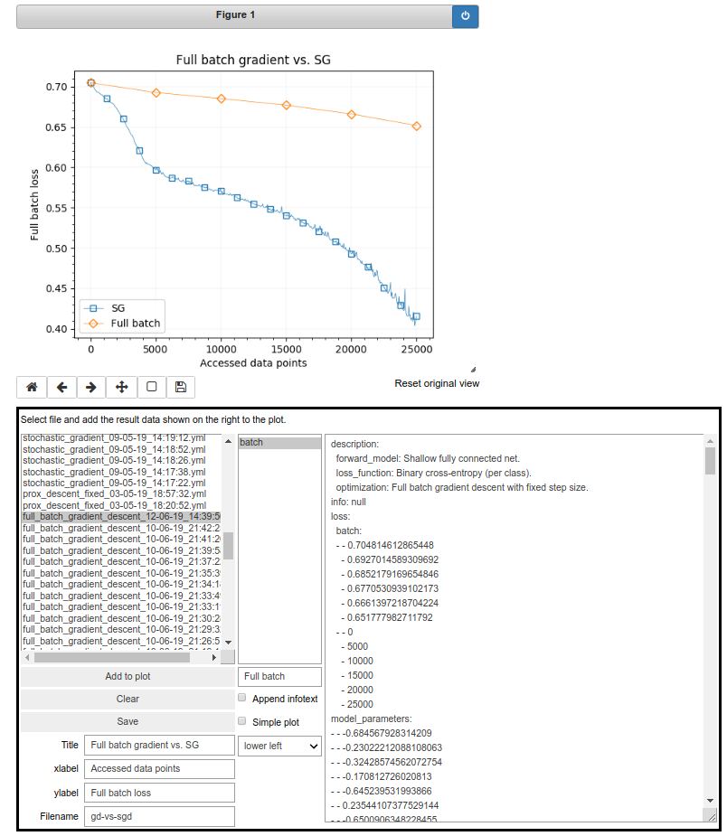

This is a simple Jupyter notebook tool which I use to plot the results of my experiments.
I often need to combine and compare the results of runs with different algorithms and parameters.
This tool reads the result yaml files and allows the selection of different losses which
should be combined in the output plot.

After `python setup.py install`, create a Jupyter notebook and run

```python
%autosave 0
%matplotlib notebook

from evaltool import EvalNotebook

inputfolder = 'results/data' # Location of yaml files.
outputfolder = 'results/plots' # Output directory for the plots.

EvalNotebook().run(inputfolder, outputfolder)
```

